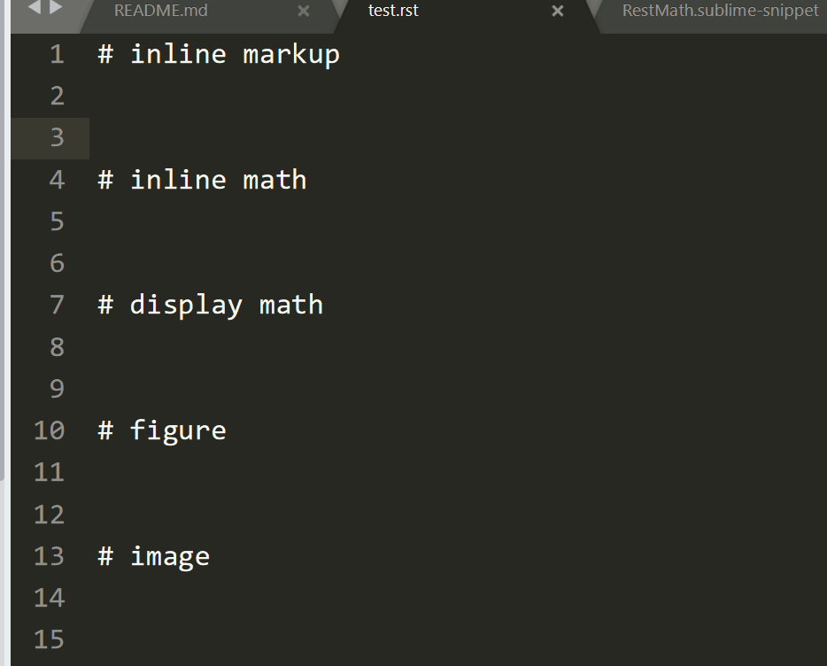

# sublsnippets
snippets for sublime plugins. 


# Installation

1. download the snippets that you like;
2. put the ``[XXX]Snippets`` folder into ``Sublime Text3 x64\Data\Packages`` folder;
3. enjoy!

# Usage

## reStructuredText Snippet

- ``:+Tab`` --> ``:ref:`label``` 
- ``m+Tab`` --> ``:math:`\alpha``` 
- ``..math+Tab`` --> ``.. math:: 
	${1:\alpha}`` 
- ``..figure+Tab`` --> ``.. figure:: ``
- ``..image+Tab`` --> ``.. image:: ``

a demo for reStructuredText Snippets:


